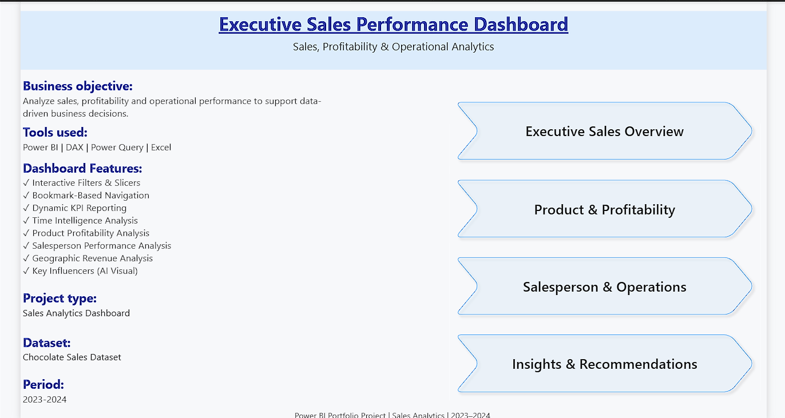
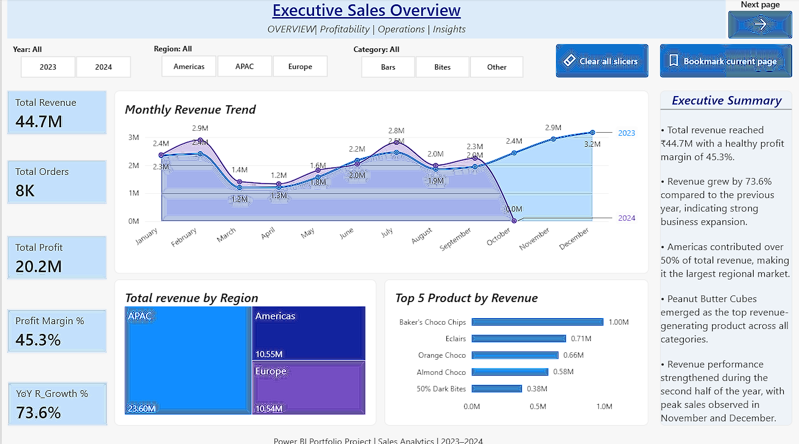
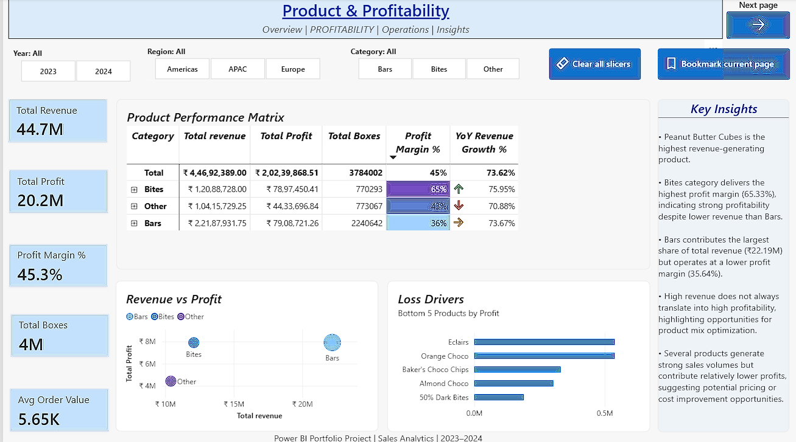
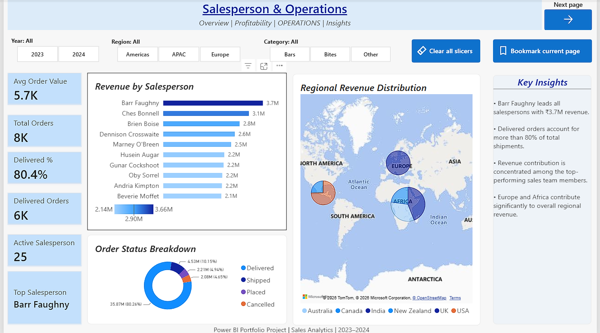
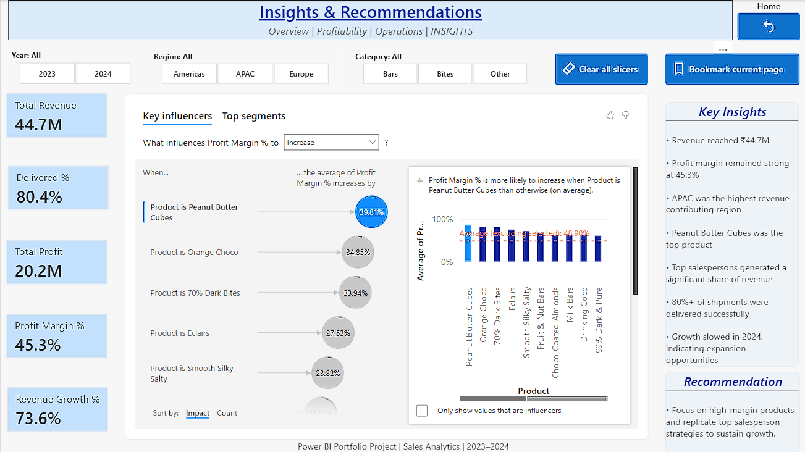

# Chocolate Sales Performance Dashboard

An interactive Power BI Business Intelligence solution designed to analyze chocolate sales performance, profitability, product trends, salesperson performance, and operational insights.

---

## Project Overview

This project transforms raw chocolate sales data into an interactive Power BI reporting solution that enables stakeholders to monitor business performance, identify profitable products, evaluate salesperson performance, and explore regional sales trends.

The dashboard combines executive KPIs, interactive filtering, profitability analysis, geographic insights, and AI-powered analytics to support data-driven decision-making.

---

## Project Snapshot

| Category | Details |
|----------|---------|
| Domain | Sales Analytics & Business Intelligence |
| Industry | FMCG / Retail |
| Tools | Power BI, Power Query, DAX, Excel |
| Dashboard Pages | 5 Interactive Reports |
| Data Source | Chocolate Sales Dataset |
| Analysis Areas | Sales, Revenue, Profitability, Products, Salespeople, Operations |

---

## Business Objectives

- Monitor overall sales and revenue performance.
- Analyze product-level profitability.
- Identify top-performing and underperforming products.
- Evaluate salesperson performance and operational efficiency.
- Analyze regional sales distribution.
- Identify key business drivers using interactive analytics.
- Provide actionable insights for business decision-making.

---

# Dashboard Pages

## 1. Home Page

The landing page introduces the project and provides navigation to the main analytical sections of the Power BI report.

<p align="center">
  
</p>

---

## 2. Executive Overview

Provides a consolidated view of overall sales performance through executive-level KPIs and interactive business visuals.

### Key Metrics

- Total Revenue
- Total Profit
- Total Boxes Sold
- Profit Margin %

### Analysis Includes

- Revenue and profit trends
- Monthly sales performance
- Regional performance
- Product-level contribution
- Overall business performance

<p align="center">
  
</p>

---

## 3. Product Profitability

Analyzes product performance to identify revenue contribution and profitability across the chocolate product portfolio.

### Analysis Includes

- Product revenue comparison
- Profitability analysis
- Profit margin evaluation
- Product-level performance trends
- Identification of high-performing products

This page helps stakeholders understand which products contribute most strongly to business revenue and profitability.

<p align="center">
  
</p>

---

## 4. Salesperson & Operations

Evaluates salesperson performance and operational sales activity across different business dimensions.

### Analysis Includes

- Salesperson performance comparison
- Revenue contribution
- Profit contribution
- Regional performance
- Geographic sales distribution
- Operational performance trends

This page supports performance evaluation and helps identify areas of operational improvement.

<p align="center">
  
</p>

---

## 5. Insights & Recommendations

Provides deeper analytical insights using interactive Power BI capabilities and AI-powered analysis.

### Analysis Includes

- Key business drivers
- Performance patterns
- Product and sales trends
- Key Influencers analysis
- Business recommendations

The page translates analytical findings into actionable recommendations that can support sales strategy and business planning.

<p align="center">
  
</p>

---

# Key Features

### Power BI

- Executive KPI Reporting
- Interactive Navigation
- Dynamic Slicers
- Cross-filtering
- Bookmarks
- Drill-down Analysis
- Matrix Visualizations
- Conditional Formatting
- Geographic Analysis
- Key Influencers AI Visual

### Data Preparation

- Power Query transformations
- Data cleaning
- Data type standardization
- Data preparation for analytical reporting

### Analytics

- Sales Trend Analysis
- Product Profitability Analysis
- Salesperson Performance Analysis
- Regional Performance Analysis
- Revenue and Profit Analysis
- Business Driver Analysis

---

# Technology Stack

| Technology | Purpose |
|------------|---------|
| Microsoft Excel | Source Dataset |
| Power Query | Data Cleaning & Transformation |
| Power BI | Dashboard Development & Visualization |
| DAX | KPI and Business Calculations |
| Power BI AI Visuals | Key Influencers Analysis |

---

# Business Value

The solution enables stakeholders to:

- Monitor overall sales and profitability performance.
- Identify high-performing products.
- Evaluate salesperson and regional performance.
- Understand key factors influencing business outcomes.
- Explore sales trends through interactive filtering.
- Support data-driven sales and operational decisions.

---

# Future Enhancements

- Automated Power BI Service data refresh.
- Advanced sales forecasting.
- Machine Learning-based sales prediction.
- Integration with cloud-based data sources.

 # About the Author

**Chhavi Chauhan**

Data Analyst with 2 years of experience specializing in Business Intelligence, Power BI, SQL, Python, and Excel.

This project demonstrates practical skills in data preparation, dashboard development, data visualization, and business analysis.

# Repository Structure

```text
Chocolate-Sales-Performance-Dashboard
│
├── Dataset
│   └── Chocolate Sales Dataset.xlsx
│
├── Images
│   ├── 01_HomePage.png
│   ├── 02_Executive_Overview.png
│   ├── 03_Product_Profitability.png
│   ├── 04_Salesperson_Operations.png
│   └── 05_Insights.png
│
├── Power BI
│   └── Chocolate Sales Performance Dashboard.pbix
│
└── README.md
